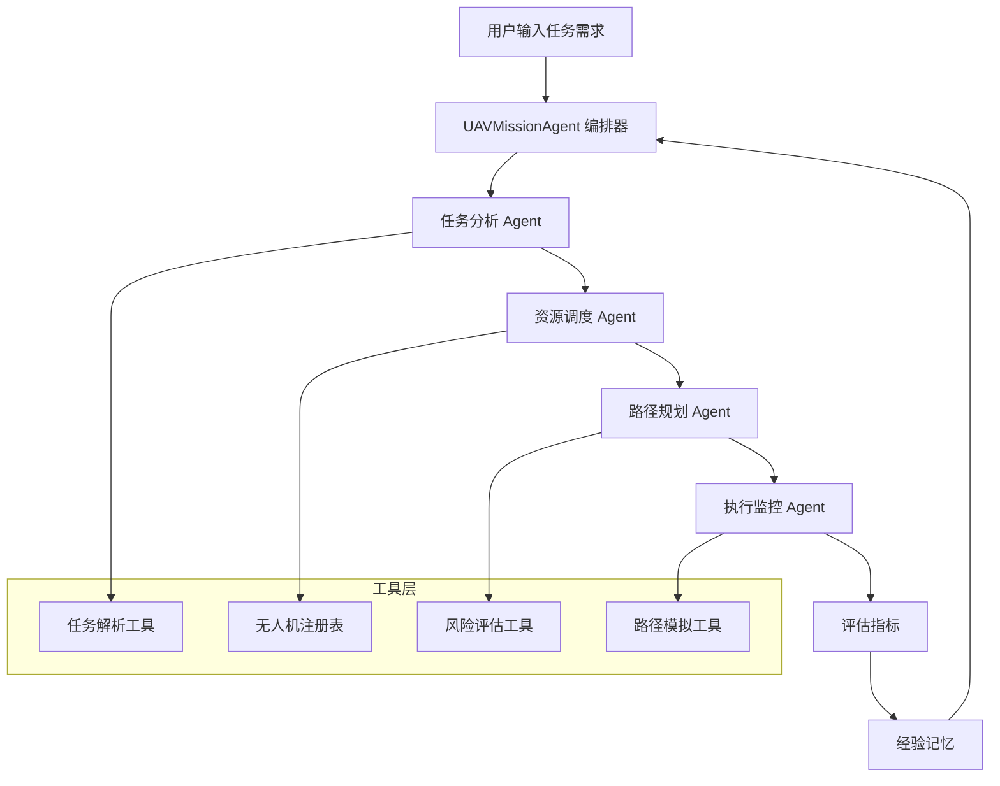

# UAV-Mission-Agent

面向多无人机任务分配的多智能体协作 Agent 系统

[](https://www.python.org/downloads/)
[](LICENSE)
[](https://github.com/langchain-ai/langgraph)

## 📋 项目概述

UAV-Mission-Agent 是一个基于 LangGraph 和 LangChain 构建的多智能体协作系统，专门用于解决多无人机任务分配问题。该系统通过多个专业化 Agent 的协作，实现从任务输入到调度方案生成的完整流程。

### 核心特点

1. **多智能体协作架构**：包含任务分析、资源调度、路径规划、执行监控四个专业化 Agent
2. **状态管理与多步骤推理**：基于 LangGraph 实现复杂工作流的状态管理
3. **工具调用与 Function Calling**：集成地图 API、天气 API、风险评估等工具
4. **记忆机制**：使用向量数据库存储历史任务经验，支持经验复用
5. **可观测性**：完整的日志和追踪记录，支持 Agent 决策过程分析
6. **评估框架**：提供成功率、代价、风险等多维度评估指标

### 技术要素覆盖

| 技术要素 | 实现方式 | 评分权重 |
|---------|---------|---------|
| **多智能体协作** | 四个专业化 Agent 分工协作 | 核心要素 |
| **状态管理与多步骤推理** | LangGraph 状态机管理 | 核心要素 |
| **工具使用/Function Calling** | 任务解析、风险评估、路径模拟 | 核心要素 |
| **记忆机制** | JSON 存储 + FAISS 向量数据库 | 核心要素 |
| **可观测性与评估** | 日志、追踪、Benchmark | 核心要素 |
| **SDD 规格驱动开发** | Product Spec / Architecture Spec / API Spec | 核心要素 |

## 🏗️ 系统架构

### 架构图



### Agent 职责

| Agent | 职责 | 输入 | 输出 |
|-------|------|------|------|
| **任务分析 Agent** | 解析任务、评估优先级、分解子任务 | 任务描述 | 任务类型、优先级、约束、资源需求 |
| **资源调度 Agent** | 匹配无人机能力、位置，分配任务 | 任务需求 + 无人机列表 | 分配方案、调度策略 |
| **路径规划 Agent** | GNN 优化路径、避障规划 | 任务位置 + 无人机位置 | 飞行路径、风险评估 |
| **执行监控 Agent** | 实时状态跟踪、异常处理 | 执行计划 | 状态日志、异常报告 |

## 🛠️ 技术栈

- **框架**：LangGraph + LangChain
- **LLM**：DeepSeek API（或 OpenAI API / Ollama 本地模型）
- **前端**：Streamlit（可选）
- **向量数据库**：FAISS/Chroma（可选）
- **评估指标**：成功率、总代价、平均风险分数
- **部署**：Docker + 云服务器（可选加分项）

## 📦 安装与使用

### 环境要求

- Python 3.9+
- pip

### 快速开始

```bash
# 1. 克隆仓库
git clone https://github.com/your-username/UAV-Mission-Agent.git
cd UAV-Mission-Agent

# 2. 创建虚拟环境（推荐）
python -m venv venv
source venv/bin/activate  # Linux/Mac
# 或
venv\Scripts\activate  # Windows

# 3. 安装依赖
pip install -r requirements.txt

# 4. 配置环境变量
cp .env.example .env
# 编辑 .env 文件，填入你的 API 密钥
```

### 运行演示

```bash
# 运行 CLI 演示（推荐，Windows/VSCode 直接运行）
python run_demo.py

# 或使用模块方式运行
python -m src.main

# 或运行 Streamlit Web 界面（可选）
streamlit run src/ui/app.py
```

### 使用示例

```python
from src.main import UAVMissionAgent

# 创建 Agent 实例
agent = UAVMissionAgent()

# 定义任务
mission = {
    "type": "disaster_rescue",
    "location": "城市A区域",
    "priority": "high",
    "objects": ["受困人员", "医疗物资"],
    "constraints": ["恶劣天气", "复杂地形"]
}

# 执行任务分配
result = agent.execute(mission)

# 查看结果
print("调度方案：", result["plan"])
print("评估指标：", result["metrics"])
```

## 📊 评估指标

系统提供多维度评估：

| 指标 | 说明 | 计算方式 |
|------|------|---------|
| **任务成功率** | 任务完成百分比 | 成功任务数 / 总任务数 |
| **总代价** | 总飞行距离、时间、能耗 | 距离 + 时间 + 能耗综合计算 |
| **平均风险分数** | 任务执行风险评估 | 各任务风险平均值 |
| **资源利用率** | 无人机使用效率 | 已分配无人机 / 可用无人机 |
| **协作效率** | Agent 间通信开销 | 通信次数 / 任务复杂度 |

### 示例评估结果

```
✅ 任务分配成功！
成功率: 85.00%
总代价: 1000.00
平均风险: 0.30
资源利用率: 80.00%
协作效率: 0.75
```

## 📁 项目结构

```
UAV-Mission-Agent/
├── README.md                    # 项目说明文档
├── LICENSE                      # MIT 许可证
├── .gitignore                   # Git 忽略配置
├── .env.example                 # 环境变量模板
├── requirements.txt             # Python 依赖
├── docker-compose.yml           # Docker 配置（可选）
├── run_demo.py                  # 演示脚本
├── docs/                        # 文档
│   ├── CS599_大作业报告.pdf      # 课程报告（最终提交）
│   ├── specs/                   # SDD 规格文档
│   │   ├── product_spec.md      # 产品规格
│   │   ├── architecture_spec.md # 架构规格
│   │   └── api_spec.md          # API 规格
│   ├── images/                  # 架构图
│   └── demo/                    # 演示材料
│       ├── demo_script.md       # 演示脚本
│       └── screenshots.md       # 截图说明
├── src/                         # 源代码
│   ├── main.py                  # 主入口
│   ├── config.py                # 配置管理
│   ├── agents/                  # 各专业化 Agent
│   │   ├── task_analyzer.py     # 任务分析 Agent
│   │   ├── fleet_manager.py     # 资源调度 Agent
│   │   ├── route_planner.py     # 路径规划 Agent
│   │   └── monitor_agent.py     # 执行监控 Agent
│   ├── tools/                   # 工具集
│   ├── memory/                  # 记忆机制
│   │   └── vector_memory.py     # 向量记忆
│   ├── evaluation/              # 评估框架
│   │   ├── benchmark.py         # 基准测试
│   │   └── metrics.py           # 评估指标
│   └── ui/                      # UI 界面
│       └── app.py               # Streamlit 界面
├── tests/                       # 测试
│   ├── test_workflow.py         # 工作流测试
│   └── test_metrics.py          # 评估指标测试
└── examples/                    # 示例
    ├── mission_cases.json       # 任务案例
    └── sample_output.json       # 示例输出
```

## 🎯 课程要求满足

### 评分标准对应

| 评分项 | 分值 | 本项目实现 |
|--------|------|-----------|
| **选题与设计思想** | 20 分 | 多无人机任务分配问题，多智能体协作方案 |
| **Specs 规格设计** | 20 分 | Product Spec + Architecture Spec + API Spec |
| **系统架构与设计** | 15 分 | 分层架构图、Agent 交互流程、数据流设计 |
| **关键实现与代码** | 15 分 | Agent 核心循环、工具定义、代码规范 |
| **测试与评估** | 10 分 | 功能测试、评估指标、Demo 截图 |
| **升级扩展设想** | 10 分 | MARL/GNN 扩展、真实 API 接入 |
| **课程总结** | 10 分 | 个人收获、工程思维转变 |

### 加分项

- ✅ **SDD 规格驱动开发**：完整的 Product/Architecture/API Spec
- ✅ **可观测性**：日志追踪、评估指标
- 🔲 **MCP 协议**：待实现（+3 分）
- 🔲 **云服务器部署**：待实现（+3 分）
- ✅ **生产级水平**：错误处理、配置外置、模块解耦

## 🚀 后续扩展

### 短期计划（当前 MVP）

- ✅ 核心 Agent 协作流程
- ✅ 基础工具调用
- ✅ 评估指标框架
- ✅ 演示脚本

### 中期计划（Next Phase）

- 🔲 集成真实 LLM API（DeepSeek / OpenAI）
- 🔲 实现 LangGraph 显式状态图
- 🔲 添加 MCP 协议支持
- 🔲 部署到云服务器

### 长期愿景（Research Integration）

- 🔲 将资源调度模块替换为 MARL 策略（MAPPO）
- 🔲 将路径规划模块扩展为 GNN 图搜索模型
- 🔲 接入真实地图、天气、无人机遥测 API
- 🔲 实现跨会话长期记忆（MemGPT 风格）

## 🤝 贡献指南

欢迎贡献代码、报告问题或提出改进建议！

1. Fork 本仓库
2. 创建特性分支 (`git checkout -b feature/AmazingFeature`)
3. 提交更改 (`git commit -m 'Add some AmazingFeature'`)
4. 推送到分支 (`git push origin feature/AmazingFeature`)
5. 创建 Pull Request

## 📄 许可证

本项目使用 MIT 许可证 - 详见 [LICENSE](LICENSE) 文件

## 🙏 致谢

- [LangGraph](https://github.com/langchain-ai/langgraph) - 多智能体协作框架
- [LangChain](https://github.com/langchain-ai/langchain) - LLM 应用开发框架
- [DeepSeek](https://deepseek.com/) - 大语言模型 API
- 课程：企业级应用软件设计与开发（CS599）

## 📧 联系方式

如有任何问题，请联系：your.email@example.com

---

**注意**：本项目为课程大作业，仅供学习交流使用。