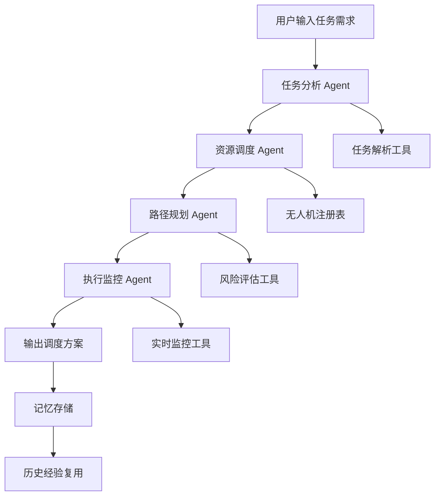

# UAV-Mission-Agent
面向多无人机任务分配的多智能体协作 Agent 系统

## 📋 项目概述

UAV-Mission-Agent 是一个基于 LangGraph 和 LangChain 构建的多智能体协作系统，专门用于解决多无人机任务分配问题。该系统通过多个专业化 Agent 的协作，实现从任务输入到调度方案生成的完整流程。

### 核心特点

1. **多智能体协作架构**：包含任务分析、资源调度、路径规划、执行监控四个专业化 Agent
2. **状态管理与多步骤推理**：基于 LangGraph 实现复杂工作流的状态管理
3. **工具调用与 Function Calling**：集成地图 API、天气 API、风险评估等工具
4. **记忆机制**：使用向量数据库存储历史任务经验，支持经验复用
5. **可观测性**：完整的日志和追踪记录，支持 Agent 决策过程分析
6. **评估框架**：提供成功率、代价、风险等多维度评估指标

## 🏗️ 系统架构

### 架构图



### Agent 职责

- **任务分析 Agent**：解析用户输入，分解任务，评估优先级
- **资源调度 Agent**：匹配无人机能力、位置，分配任务
- **路径规划 Agent**：使用 GNN 优化路径，进行避障规划
- **执行监控 Agent**：实时状态跟踪，异常处理，进度报告

## 🛠️ 技术栈

- **框架**：LangGraph + LangChain
- **LLM**：DeepSeek API（或其他 LLM）
- **前端**：Streamlit（可选）
- **向量数据库**：FAISS/Chroma
- **评估指标**：成功率、总代价、平均风险分数

## 📦 安装与使用

### 安装依赖

```bash
# 克隆仓库
git clone https://github.com/your-username/UAV-Mission-Agent.git
cd UAV-Mission-Agent

# 创建虚拟环境（推荐）
python -m venv venv
source venv/bin/activate  # Linux/Mac
# 或
venv\Scripts\activate  # Windows

# 安装依赖
pip install -r requirements.txt
```

### 配置环境变量

```bash
# 复制示例配置文件
cp .env.example .env

# 编辑 .env 文件，填入你的 API 密钥
DEEPSEEK_API_KEY=your_api_key_here
```

### 运行演示

```bash
# 运行 CLI 演示（推荐，Windows/VSCode 直接运行）
python run_demo.py

# 或使用模块方式运行
python -m src.main

# 或运行 Streamlit Web 界面（可选）
streamlit run src/ui/app.py
```

### 使用示例

```python
from src.main import UAVMissionAgent

# 创建 Agent 实例
agent = UAVMissionAgent()

# 定义任务
mission = {
    "type": "disaster_rescue",
    "location": "城市A区域",
    "priority": "high",
    "objects": ["受困人员", "医疗物资"],
    "constraints": ["恶劣天气", "复杂地形"]
}

# 执行任务分配
result = agent.execute(mission)

# 查看结果
print("调度方案：", result["plan"])
print("评估指标：", result["metrics"])
```

## 📊 评估指标

系统提供多维度评估：

- **任务成功率**：任务完成百分比
- **总代价**：总飞行距离、时间、能耗
- **平均风险分数**：任务执行风险评估
- **协作效率**：Agent 间通信开销

## 📁 项目结构

```
UAV-Mission-Agent/
├── README.md                    # 项目说明文档
├── requirements.txt             # 依赖列表
├── .env.example                # 环境变量示例
├── docs/                        # 文档
│   ├── specs/                  # 规格文档
│   │   ├── product_spec.md     # 产品规格
│   │   ├── architecture_spec.md # 架构规格
│   │   └── api_spec.md         # API 规格
│   └── demo/                   # 演示材料
├── src/                         # 源代码
│   ├── main.py                 # 主入口
│   ├── config.py               # 配置管理
│   ├── graph/                  # LangGraph 状态管理
│   ├── agents/                 # 各专业化 Agent
│   ├── tools/                  # 工具集
│   ├── memory/                 # 记忆机制
│   └── evaluation/             # 评估框架
├── tests/                       # 测试
└── examples/                    # 示例
```

## 🎯 课程要求满足

### 技术要素覆盖

1. ✅ **多智能体协作**：四个专业化 Agent 协作完成任务
2. ✅ **状态管理与多步骤推理**：LangGraph 状态机管理
3. ✅ **工具使用/Function Calling**：集成多种工具
4. ✅ **记忆机制**：向量数据库存储历史经验
5. ✅ **可观测性**：日志、追踪、评估指标

### 交付物

1. ✅ **GitHub 仓库**：完整的项目代码和文档
2. ✅ **SDD 文档**：Product Spec + Architecture Spec + API Spec
3. ✅ **5 分钟演示**：可运行的 Demo 和演示脚本
4. ✅ **评估结果**：性能测试数据和分析

## 🤝 贡献指南

欢迎贡献代码、报告问题或提出改进建议！

1. Fork 本仓库
2. 创建特性分支 (`git checkout -b feature/AmazingFeature`)
3. 提交更改 (`git commit -m 'Add some AmazingFeature'`)
4. 推送到分支 (`git push origin feature/AmazingFeature`)
5. 创建 Pull Request

## 📄 许可证

本项目使用 MIT 许可证 - 详见 [LICENSE](LICENSE) 文件

## 📧 联系方式

如有任何问题，请联系：your.email@example.com