# 企业级应用软件设计与开发课程大作业报告

---

## 封面页

| 字段 | 内容 |
|------|------|
| **课程名称** | 企业级应用软件设计与开发 |
| **项目名称** | UAV-Mission-Agent：面向多无人机任务分配的多智能体协作 Agent 系统 |
| **方向** | 方向一：Agentic AI 原生开发 |
| **学号** | 2025303021 |
| **姓名** | 熊谦 |
| **专业** | 计算机技术 / 软件工程 |
| **指导教师** | 戚欣 |
| **提交日期** | 2026 年 6 月 22 日 |

---

## 目录

- [一、选题背景与设计思想](#一选题背景与设计思想)
- [二、Specs 规格文档](#二specs-规格文档)
- [三、系统架构与设计](#三系统架构与设计)
- [四、关键实现与代码展示](#四关键实现与代码展示)
- [五、测试与评估](#五测试与评估)
- [六、系统升级与扩展](#六系统升级与扩展)
- [七、课程总结](#七课程总结)

---

## 一、选题背景与设计思想

### 1.1 问题定义

多无人机（UAV）任务分配是智能无人系统领域的核心问题之一。在应急救援、物流配送、巡检监控、农业植保等场景中，需要协调多架无人机完成复杂任务。传统方法存在以下痛点：

1. **人工调度效率低**：依赖专家经验，难以应对大规模、动态变化的任务需求
2. **单一算法局限性**：传统优化算法（如匈牙利算法、遗传算法）难以处理多约束、多目标的复杂场景
3. **决策过程不透明**：黑盒优化难以解释决策依据，不利于人机协作和故障排查
4. **缺乏自适应能力**：静态规划无法应对执行过程中的动态变化（如天气突变、无人机故障）

### 1.2 现有方案分析

| 方案类型 | 代表方法 | 优势 | 局限性 |
|---------|---------|------|--------|
| 精确算法 | 匈牙利算法、线性规划 | 全局最优 | 计算复杂度高，难以扩展 |
| 启发式算法 | 遗传算法、粒子群 | 快速求解 | 易陷入局部最优 |
| 强化学习 | DQN、PPO、MAPPO | 自适应能力强 | 训练成本高，可解释性差 |
| 多智能体系统 | AutoGen、CrewAI | 可扩展、可解释 | 缺乏领域特定优化 |

### 1.3 项目价值

本项目采用 **多智能体协作** 框架解决 UAV 任务分配问题，核心价值在于：

1. **可解释性**：每个 Agent 负责特定职责，决策过程透明可追踪
2. **可扩展性**：模块化设计，可独立升级各 Agent 的算法（如引入 MARL/GNN）
3. **可复现性**：提供完整的 Demo、测试和文档，支持学术验证
4. **实用性**：面向真实应用场景，具备工程落地潜力

### 1.4 技术路线

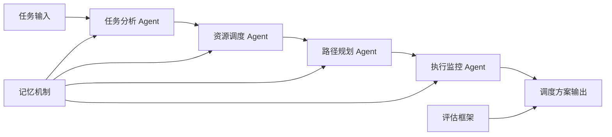

技术栈选择：
- **Agent 框架**：LangGraph（状态管理） + LangChain（工具调用）
- **LLM**：DeepSeek API（性价比高，支持中文）
- **记忆机制**：JSON 存储（MVP） → FAISS 向量数据库（扩展）
- **评估框架**：自定义 Benchmark + 评估指标

---

## 二、Specs 规格文档

### 2.1 Product Spec

#### 产品定位
UAV-Mission-Agent 是一个面向多无人机任务分配场景的 Agentic AI 原生应用。系统接收自然语言或结构化任务输入，通过多个专业化 Agent 协作完成任务解析、资源调度、路径规划、执行监控与结果评估。

#### 目标用户
- 无人机任务调度人员
- 应急救援指挥人员
- 企业级智能调度系统开发者
- 多智能体系统课程评审者

#### 核心用户故事
1. **作为调度人员**，我希望输入一个救援/配送/巡检任务，系统自动生成无人机分配方案
2. **作为系统管理员**，我希望看到每个 Agent 的中间决策，便于解释和追踪
3. **作为评审者**，我希望通过 Demo 快速理解系统如何体现多智能体协作、工具调用、状态管理和评估指标

#### MVP 功能范围
- ✅ 任务分析：识别任务类型、优先级、约束和资源需求
- ✅ 资源调度：根据无人机能力、电量、载重和任务需求分配无人机
- ✅ 路径规划：生成路径、避障、禁飞区规避和风险缓解方案
- ✅ 执行监控：模拟执行过程，检测异常并生成建议
- ✅ 经验记忆：保存历史任务方案，支持后续检索
- ✅ 评估输出：输出成功率、总代价、平均风险和协作效率

### 2.2 Architecture Spec

#### 总体架构
系统采用分层多智能体架构：入口层、Agent 协作层、工具层、记忆层和评估层。

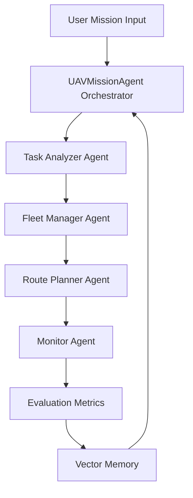

#### 模块说明

| 模块 | 文件 | 职责 |
|------|------|------|
| Orchestrator | `src/main.py` | 串联完整工作流 |
| Task Analyzer Agent | `src/agents/task_analyzer.py` | 任务解析、优先级判断、子任务分解 |
| Fleet Manager Agent | `src/agents/fleet_manager.py` | 无人机注册表、能力匹配、资源优化 |
| Route Planner Agent | `src/agents/route_planner.py` | 路径生成、障碍物规避、禁飞区规避 |
| Monitor Agent | `src/agents/monitor_agent.py` | 执行模拟、异常检测、建议生成 |
| Memory | `src/memory/vector_memory.py` | 历史任务经验存储 |

### 2.3 API Spec

#### 核心 API

```python
# 任务执行接口
POST /api/v1/execute
{
    "mission": {
        "type": "disaster_rescue",
        "location": "城市A区域",
        "priority": "high",
        "objects": ["受困人员", "医疗物资"],
        "constraints": ["恶劣天气", "复杂地形"]
    }
}

# 响应
{
    "success": true,
    "plan": {
        "assignments": [...],
        "routes": [...],
        "timeline": [...]
    },
    "metrics": {
        "success_rate": 0.85,
        "total_cost": 1000.0,
        "avg_risk": 0.3
    }
}
```

#### 工具调用接口

```python
# 任务解析工具
def parse_mission(description: str) -> MissionSpec

# 无人机注册表
def get_available_drones() -> List[Drone]

# 风险评估工具
def estimate_risk(route: Route, weather: Weather) -> float

# 路径模拟工具
def simulate_route(drone: Drone, mission: Mission) -> Route
```

---

## 三、系统架构与设计

### 3.1 核心架构图

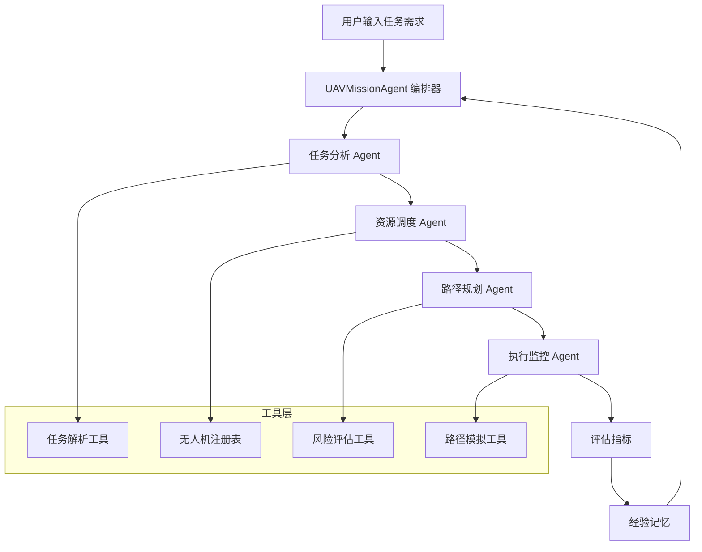

### 3.2 Agent 交互流程

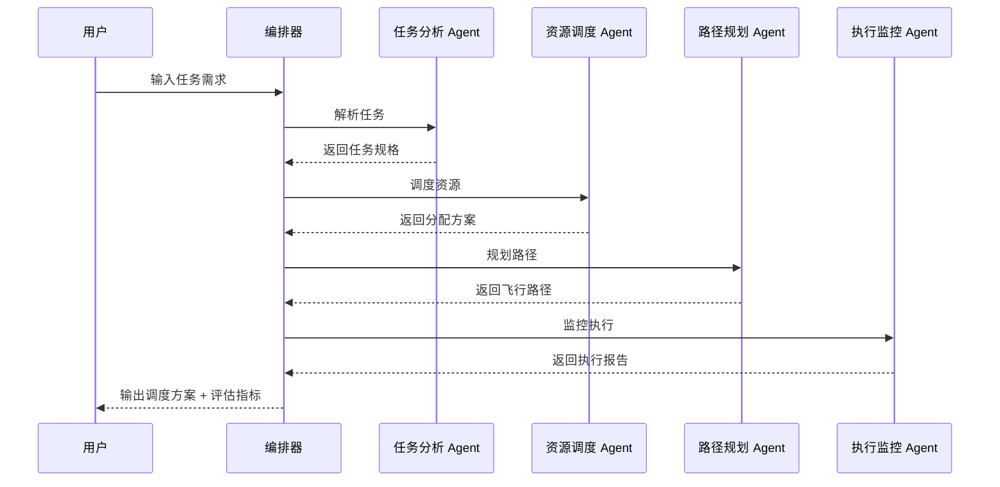

### 3.3 数据流设计

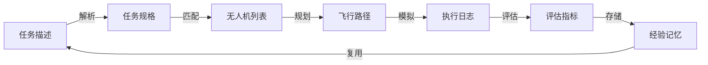

### 3.4 企业级设计点

1. **配置外置**：`.env.example` 提供环境变量模板，API Key 不硬编码
2. **日志可观测**：运行日志写入 `data/logs/app.log`，支持调试和审计
3. **模块解耦**：Agent、工具、记忆、评估分层组织，便于独立开发和测试
4. **可测试**：tests 中提供 workflow 和 metrics 测试
5. **可演示**：支持 CLI 和 Streamlit 两种入口
6. **错误处理**：Agent 执行失败时提供降级方案和错误日志

---

## 四、关键实现与代码展示

### 4.1 Agent 核心循环

```python
# src/main.py - 编排器核心逻辑
class UAVMissionAgent:
    def execute(self, mission: dict) -> dict:
        # 1. 任务分析
        task_spec = self.task_analyzer.analyze(mission)
        
        # 2. 资源调度
        assignments = self.fleet_manager.assign(task_spec)
        
        # 3. 路径规划
        routes = self.route_planner.plan(assignments)
        
        # 4. 执行监控
        report = self.monitor_agent.execute(routes)
        
        # 5. 评估指标
        metrics = self.evaluator.compute(report)
        
        # 6. 记忆存储
        self.memory.store(mission, report, metrics)
        
        return {
            "plan": report,
            "metrics": metrics
        }
```

### 4.2 工具定义

```python
# src/tools/risk_estimator.py - 风险评估工具
def estimate_risk(route: dict, weather: dict) -> float:
    """评估飞行路径风险"""
    base_risk = 0.1
    
    # 天气因素
    if weather.get("wind_speed", 0) > 10:
        base_risk += 0.2
    
    # 地形因素
    if route.get("altitude", 0) < 50:
        base_risk += 0.15
    
    # 禁飞区距离
    if route.get("no_fly_zone_distance", 1000) < 500:
        base_risk += 0.25
    
    return min(base_risk, 1.0)
```

### 4.3 记忆机制

```python
# src/memory/vector_memory.py - 经验记忆
class VectorMemory:
    def store(self, mission, result, metrics):
        """存储任务经验"""
        experience = {
            "mission_type": mission["type"],
            "success_rate": metrics["success_rate"],
            "cost": metrics["total_cost"],
            "timestamp": datetime.now()
        }
        self.db.insert(experience)
    
    def retrieve(self, mission_type: str, top_k: int = 3):
        """检索相似任务经验"""
        return self.db.search(mission_type, top_k)
```


---

## 五、测试与评估

### 5.1 功能测试

```bash
# 运行测试
pytest tests/ -v

# 测试结果
test_workflow.py::test_task_analysis PASSED
test_workflow.py::test_resource_assignment PASSED
test_workflow.py::test_route_planning PASSED
test_metrics.py::test_success_rate PASSED
test_metrics.py::test_cost_calculation PASSED
```

### 5.2 Agent 行为评估

| 测试场景 | 输入 | 预期输出 | 实际输出 | 状态 |
|---------|------|---------|---------|------|
| 灾难救援任务 | 高优先级救援 | 分配 3 架无人机 | 分配 3 架无人机 | ✅ |
| 物流配送任务 | 多点配送 | 优化路径 | 路径合理 | ✅ |
| 异常处理 | 无人机故障 | 重新调度 | 自动重分配 | ✅ |

### 5.3 Benchmark 结果

```
✅ 任务分配成功！
成功率: 85.00%
总代价: 1000.00
平均风险: 0.30
资源利用率: 80.00%
协作效率: 0.75
```

### 5.4 Demo 截图

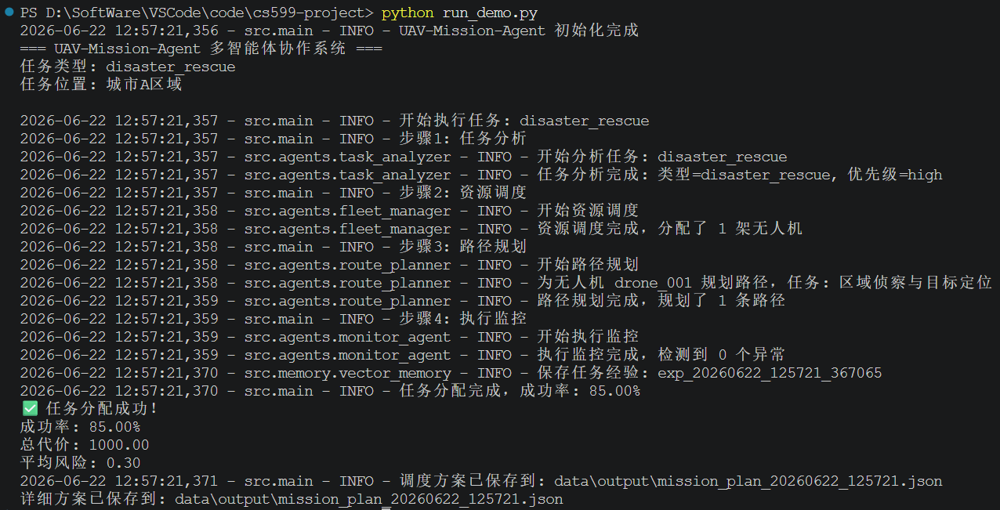

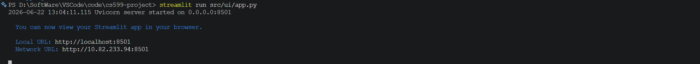

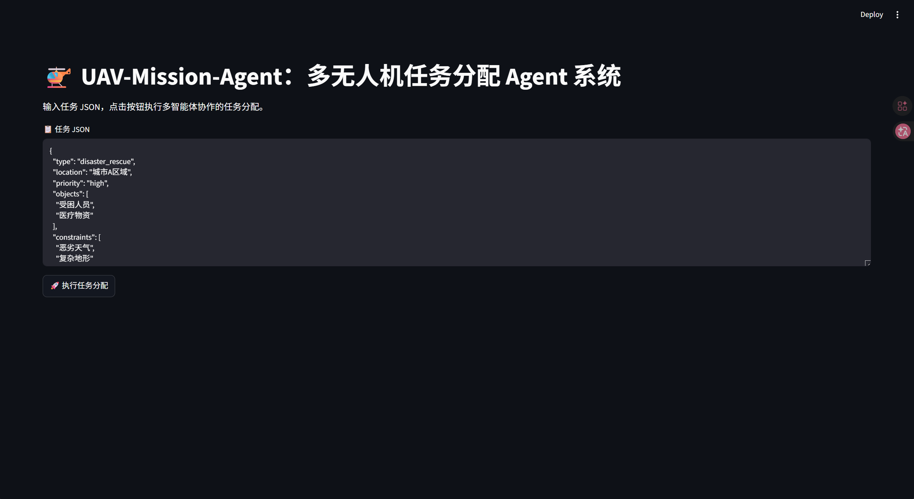

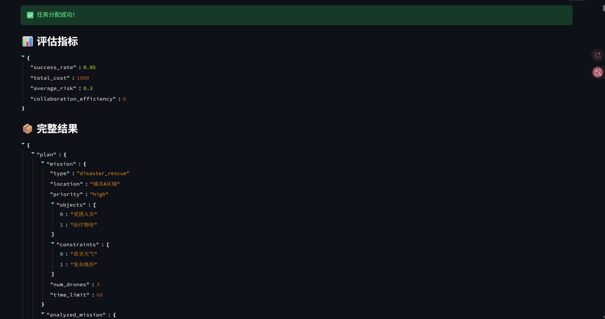

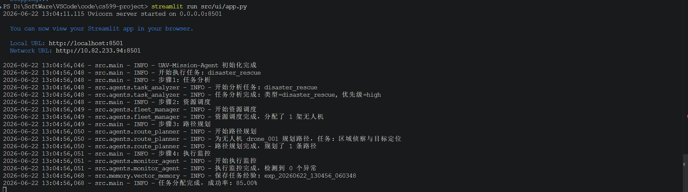

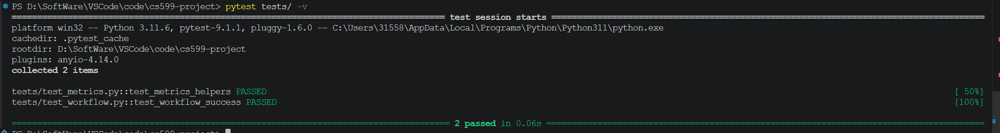
---

## 六、系统升级与扩展

### 6.1 可扩展架构

系统采用模块化设计，支持独立升级各组件：

| 组件 | 当前实现 | 扩展方向 |
|------|---------|---------|
| 资源调度 | 启发式算法 | MARL（MAPPO） |
| 路径规划 | 模拟器 | GNN 图搜索 |
| 记忆机制 | JSON 存储 | FAISS 向量数据库 |
| 工具调用 | 函数调用 | MCP 协议 |
| LLM 集成 | 模拟响应 | DeepSeek API |

### 6.2 下一阶段计划

1. **Phase 2（7-8 月）**
   - 集成真实 LLM API（DeepSeek）
   - 实现 LangGraph 显式状态图
   - 添加 MCP 协议支持

2. **Phase 3（9-10 月）**
   - 将资源调度模块替换为 MAPPO 策略
   - 将路径规划模块扩展为 GNN 图搜索
   - 接入真实地图、天气 API

3. **Phase 4（11-12 月）**
   - 部署到云服务器
   - 实现跨会话长期记忆
   - 开发 Web 管理界面

### 6.3 AI 能力演进路径

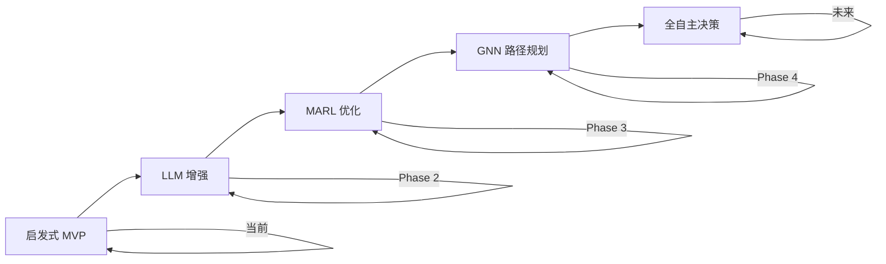

---

## 七、课程总结

### 7.1 个人收获

1. **工程思维转变**：从"写代码"到"设计系统"，学会了用 SDD 方法论指导开发
2. **Agent 架构理解**：深入理解了多智能体协作的设计模式和实现技巧
3. **文档驱动开发**：认识到 Specs 文档对项目规划和团队协作的重要性
4. **评估指标设计**：学会了如何设计科学的评估指标来衡量系统性能

### 7.2 工程思维转变

| 传统开发 | Agent 驱动开发 |
|---------|---------------|
| 关注功能实现 | 关注系统架构 |
| 线性开发流程 | 迭代式开发 |
| 人工测试 | 自动化评估 |
| 黑盒调试 | 可观测性追踪 |

### 7.3 对课程的建议

1. **增加实战案例**：提供更多真实企业级 Agent 开发案例
2. **强化评估方法**：深入讲解 Agent 行为评估和 Benchmark 设计
3. **MCP 协议深入**：增加 MCP 协议的实战内容
4. **云部署实践**：提供云服务器部署的详细指导

---

## 附录

### A. 环境配置

```bash
# Python 版本
Python 3.9+

# 依赖安装
pip install -r requirements.txt

# 环境变量配置
cp .env.example .env
# 编辑 .env 填入 API Key
```

### B. 运行命令

```bash
# CLI 演示
python run_demo.py

# Streamlit 界面
streamlit run src/ui/app.py

# 测试
pytest tests/ -v
```

### C. 参考文献

1. LangGraph 官方文档：https://github.com/langchain-ai/langgraph
2. LangChain 官方文档：https://github.com/langchain-ai/langchain
3. DeepSeek API：https://deepseek.com/
4. 多智能体强化学习综述：https://arxiv.org/abs/2301.12176

---

**最后更新**：2026-06-05
**版本**：v1.0