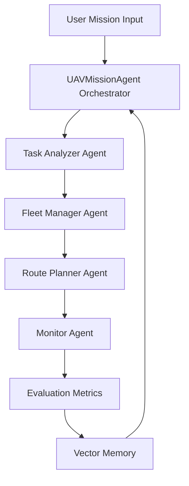

# Architecture Spec：UAV-Mission-Agent

## 1. 总体架构
系统采用分层多智能体架构：入口层、Agent 协作层、工具层、记忆层和评估层。

## 2. 模块说明

### 2.1 Orchestrator
`src/main.py` 中的 `UAVMissionAgent` 负责串联完整工作流。

### 2.2 Task Analyzer Agent
输入任务描述，输出：任务类型、优先级、子任务、约束、风险和资源需求。

### 2.3 Fleet Manager Agent
维护无人机资源注册表，并根据能力、电量、载重、任务需求进行调度。

### 2.4 Route Planner Agent
基于模拟地图、障碍物和禁飞区生成飞行路径，并输出路径长度、耗时、能耗和风险。

### 2.5 Monitor Agent
模拟执行过程，生成状态日志，检测低电量、通信异常、进度异常等问题。

### 2.6 Memory
当前采用 JSON 存储，后续可迁移到 FAISS/Chroma 向量数据库。

## 3. 企业级设计点
- 配置外置：`.env.example` 提供环境变量模板。
- 日志可观测：运行日志写入 `data/logs/app.log`。
- 模块解耦：Agent、工具、记忆、评估分层组织。
- 可测试：tests 中提供 workflow 和 metrics 测试。
- 可演示：支持 CLI 和 Streamlit 两种入口。

## 4. 与研究方向的结合
本项目代码层面先实现启发式 MVP，报告中可说明未来将 Fleet Manager 替换为 MARL 调度策略，将 Route Planner 替换为 GNN 图路径规划，从而与多智能体强化学习、图神经网络和无人机任务分配研究方向自然衔接。
